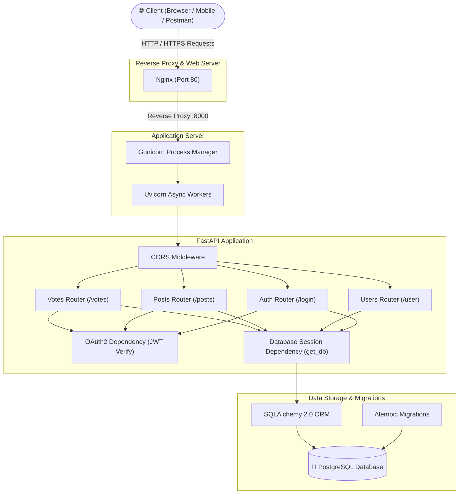
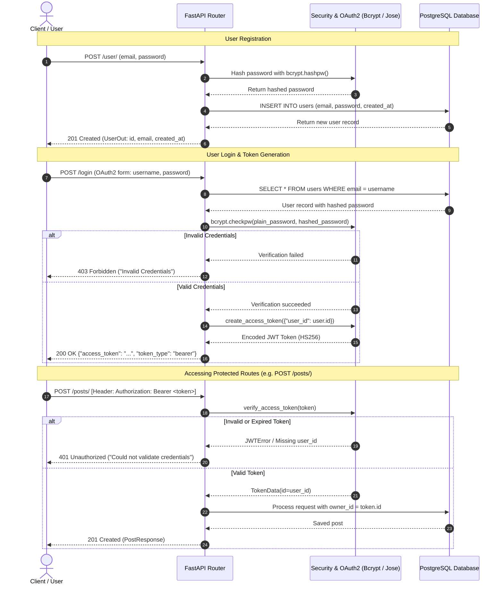
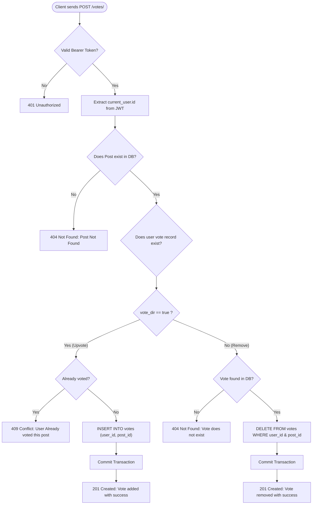

# 🚀 Social Media REST API (FastAPI)

[](https://www.python.org/)
[](https://fastapi.tiangolo.com/)
[](https://www.postgresql.org/)
[](https://www.sqlalchemy.org/)
[](https://alembic.sqlalchemy.org/)
[](https://jwt.io/)
[](https://www.docker.com/)
[](https://docs.pytest.org/)

A modern, production-ready backend REST API for a social media platform built with **FastAPI**, **SQLAlchemy 2.0**, **PostgreSQL**, **Alembic**, and **Pytest**. It features secure JWT authentication, password hashing with **Bcrypt**, full CRUD operations for user posts, an interactive upvoting/like system with SQL aggregations, search and pagination capabilities, Docker containerization, production deployment scripts (Nginx + Gunicorn systemd), and a comprehensive automated test suite.

---

## 📑 Table of Contents

- [Key Features](#-key-features)
- [System Architecture](#-system-architecture)
- [Application Flow Diagrams](#-application-flow-diagrams)
  - [1. Authentication & JWT Authorization Flow](#1-authentication--jwt-authorization-flow)
  - [2. Post & Vote Processing Flow](#2-post--vote-processing-flow)
  - [3. Entity-Relationship Diagram (ERD)](#3-entity-relationship-diagram-erd)
- [Project Directory Structure](#-project-directory-structure)
- [Database Schema](#-database-schema)
- [Environment Variables](#-environment-variables)
- [API Endpoints Reference](#-api-endpoints-reference)
  - [Public & Authentication](#public--authentication)
  - [User Management](#user-management)
  - [Posts Management](#posts-management)
  - [Votes (Likes) Management](#votes-likes-management)
- [Getting Started & Local Setup](#-getting-started--local-setup)
  - [Prerequisites](#prerequisites)
  - [Installation Steps](#installation-steps)
  - [Database Migrations](#database-migrations)
  - [Running the Server](#running-the-server)
- [Docker & Docker Compose](#-docker--docker-compose)
  - [Development Environment](#development-environment)
  - [Production Environment](#production-environment)
- [Production Deployment](#-production-deployment)
  - [Gunicorn Systemd Service](#gunicorn-systemd-service)
  - [Nginx Reverse Proxy](#nginx-reverse-proxy)
- [Running Automated Tests](#-running-automated-tests)
  - [Test Database Isolation](#test-database-isolation)
  - [Pytest Fixtures Architecture](#pytest-fixtures-architecture)
  - [Test Suites Breakdown](#test-suites-breakdown)
  - [Running the Tests](#running-the-tests)
- [License & Authors](#-license--authors)

---

## ✨ Key Features

- **High Performance**: Built on top of FastAPI and Starlette, utilizing asynchronous event handling and Uvicorn.
- **Robust Security & Auth**:
  - Direct bcrypt hashing with cryptographic salting for passwords.
  - OAuth2 Password Bearer flow generating signed JSON Web Tokens (JWT) using HMAC-SHA256 (`HS256`).
  - Protected API routes with centralized dependency injection (`get_current_user`).
- **Post Management & Ownership**:
  - Full CRUD operations (Create, Read, Update, Delete).
  - Strict authorization: Users can only modify or delete their own posts.
  - Search query filtering across titles and content.
  - Result pagination via limit parameters.
- **Interactive Voting System**:
  - Toggle upvotes (like/unlike).
  - Duplicate vote prevention with proper HTTP 409 conflict handling.
  - High-performance SQL `OUTER JOIN` and `GROUP BY` aggregations to return total like counts per post.
- **Relational Integrity**:
  - PostgreSQL foreign keys with cascading updates and deletes (`ON DELETE CASCADE`, `ON UPDATE CASCADE`).
- **Database Migrations**:
  - Managed with Alembic for automated, reversible schema version control.
- **Deployment Ready**:
  - Production-ready `Dockerfile` based on `python:3.12-slim`.
  - Development and Production Docker Compose configs.
  - Nginx reverse proxy template and Gunicorn systemd service unit.

---

## 🏛 System Architecture

The following diagram illustrates the high-level architecture of the system:



---

## 🔄 Application Flow Diagrams

### 1. Authentication & JWT Authorization Flow



---

### 2. Post & Vote Processing Flow



---

### 3. Entity-Relationship Diagram (ERD)

```mermaid
erDiagram
    USERS ||--o{ POSTS : "creates / owns"
    USERS ||--o{ VOTES : "casts"
    POSTS ||--o{ VOTES : "receives"

    USERS {
        int id PK "Serial, Primary Key"
        varchar email UK "Unique, Not Null"
        varchar password "Hashed bcrypt string, Not Null"
        timestamp with_timezone created_at "Default NOW(), Not Null"
    }

    POSTS {
        int id PK "Serial, Primary Key"
        varchar title "Not Null"
        varchar content "Not Null"
        boolean published "Default TRUE, Not Null"
        int owner_id FK "Foreign Key -> USERS.id (ON DELETE CASCADE)"
        timestamp with_timezone created_at "Default NOW(), Not Null"
    }

    VOTES {
        int user_id PK,FK "Foreign Key -> USERS.id (ON DELETE/UPDATE CASCADE)"
        int post_id PK,FK "Foreign Key -> POSTS.id (ON DELETE/UPDATE CASCADE)"
    }
```

---

## 📁 Project Directory Structure

```text
social-media_app.fastapi/
│
├── alembic/                          # Alembic database migration environment
│   ├── versions/                     # Revision migration scripts
│   │   ├── 4b537867a3fc_create_users_table.py
│   │   ├── 995645a8c679_create_posts_table.py
│   │   └── 8c896ee70352_add_votes_with_auto_generate.py
│   ├── env.py                        # Migration runtime configuration
│   └── script.py.mako                # Template for generating revisions
│
├── app/                              # Core application package
│   ├── routers/                      # API endpoint route definitions
│   │   ├── auth.py                   # Login & JWT token issuance (/login)
│   │   ├── user.py                   # User registration and lookup (/user)
│   │   ├── post.py                   # Post CRUD with vote aggregation (/posts)
│   │   └── vote.py                   # Upvote and unvote handling (/votes)
│   ├── calc.py                       # Helper utility / demo calculations
│   ├── config.py                     # Pydantic BaseSettings (.env loader)
│   ├── database.py                   # SQLAlchemy engine, session maker & get_db
│   ├── main.py                       # FastAPI entry point & CORS configuration
│   ├── models.py                     # SQLAlchemy database models (User, Post, Vote)
│   ├── oauth2.py                     # JWT token generation, decoding & validation
│   ├── schemas.py                    # Pydantic schemas (Request / Response validation)
│   └── utils.py                      # Bcrypt password hashing & verification
│
├── tests/                            # Automated test suite (Pytest)
│   ├── __init__.py
│   ├── conftest.py                   # Centralized fixtures, DB engine, and auth setup
│   ├── test_users.py                 # Registration, login, & authentication tests
│   ├── test_posts.py                 # Post CRUD, authorization, & ownership tests
│   └── test_votes.py                 # Upvoting, duplicate prevention, & vote removal tests
│
├── .dockerignore                     # Docker build exclusion rules
├── .env                              # Environment variable definitions (DO NOT COMMIT SECRETS)
├── .gitignore                        # Git exclusion rules
├── alembic.ini                       # Alembic CLI configuration file
├── Dockerfile                        # Docker container build definition
├── docker-compose-dev.yaml           # Docker Compose file for local development
├── docker-compose-prod.yaml          # Docker Compose file for production deployment
├── gunicorn.service                  # Systemd service unit for Gunicorn production daemon
├── nginx                             # Nginx reverse proxy configuration file
└── requirements.txt                  # Python dependencies manifest
```

---

## 🗄 Database Schema

The database consists of three primary tables linked by relational constraints:

### `users`
| Column | Type | Constraints | Description |
| :--- | :--- | :--- | :--- |
| `id` | `INTEGER` | Primary Key, Auto-Increment | Unique user identifier |
| `email` | `VARCHAR` | Unique, Not Null | User login email address |
| `password` | `VARCHAR` | Not Null | Bcrypt hashed password |
| `created_at` | `TIMESTAMP WITH TIME ZONE` | Not Null, Default: `NOW()` | Account creation timestamp |

### `posts`
| Column | Type | Constraints | Description |
| :--- | :--- | :--- | :--- |
| `id` | `INTEGER` | Primary Key, Auto-Increment | Unique post identifier |
| `title` | `VARCHAR` | Not Null | Post title |
| `content` | `VARCHAR` | Not Null | Text content of the post |
| `published`| `BOOLEAN` | Not Null, Default: `TRUE` | Publication visibility flag |
| `owner_id` | `INTEGER` | Not Null, FK (`users.id` ON DELETE CASCADE) | ID of the author user |
| `created_at`| `TIMESTAMP WITH TIME ZONE` | Not Null, Default: `NOW()` | Timestamp when post was created |

### `votes`
| Column | Type | Constraints | Description |
| :--- | :--- | :--- | :--- |
| `user_id` | `INTEGER` | Composite PK, FK (`users.id` ON UPDATE/DELETE CASCADE) | Voting user |
| `post_id` | `INTEGER` | Composite PK, FK (`posts.id` ON UPDATE/DELETE CASCADE) | Voted post |

---

## ⚙️ Environment Variables

The application utilizes [`pydantic-settings`](app/config.py) to read configuration from environment variables or a local `.env` file.

Create a `.env` file in the project root:

```env
DATABASE_NAME=social_media_app
DATABASE_USERNAME=postgres
DATABASE_PASSWORD=your_secure_password
DATABASE_HOSTNAME=localhost
DATABASE_PORT=5432
SECRET_KEY=your_super_secret_random_64_character_hex_key
ALGORITHM=HS256
ACCESS_TOKEN_EXPIRE_MINUTES=60
```

### Configuration Parameters

| Parameter | Type | Required | Description |
| :--- | :--- | :---: | :--- |
| `DATABASE_NAME` | string | Yes | Name of the PostgreSQL database. |
| `DATABASE_USERNAME` | string | Yes | PostgreSQL user with database privileges. |
| `DATABASE_PASSWORD` | string | Yes | PostgreSQL user password. |
| `DATABASE_HOSTNAME` | string | Yes | Database host (`localhost` or container name `postgres`). |
| `DATABASE_PORT` | string | Yes | Database port (standard: `5432`). |
| `SECRET_KEY` | string | Yes | Secret cryptographic key used to sign JWT tokens. |
| `ALGORITHM` | string | Yes | JWT signing algorithm (e.g., `HS256`). |
| `ACCESS_TOKEN_EXPIRE_MINUTES` | int | Yes | Token expiration lifetime in minutes (e.g., `60`). |

---

## 📡 API Endpoints Reference

Interactive documentation is automatically generated by FastAPI:
- **Swagger UI**: [http://localhost:8000/docs](http://localhost:8000/docs)
- **ReDoc UI**: [http://localhost:8000/redoc](http://localhost:8000/redoc)

### Summary Table

| Method | Endpoint | Auth Required | Description |
| :--- | :--- | :---: | :--- |
| `GET` | `/` | No | Health check / Welcome greeting |
| `POST` | `/login` | No | Authenticate user & retrieve JWT access token |
| `POST` | `/user/` | No | Register a new user |
| `GET` | `/user/{id}` | No | Retrieve public profile for a user by ID |
| `GET` | `/posts/` | Yes | List posts with vote counts (supports search & limit) |
| `POST` | `/posts/` | Yes | Create a new post |
| `GET` | `/posts/{id}` | Yes | Retrieve a single post with vote count |
| `PUT` | `/posts/{id}` | Yes | Update an existing post (owner only) |
| `DELETE`| `/posts/{id}` | Yes | Delete a post (owner only) |
| `POST` | `/votes/` | Yes | Like or remove like from a post |

---

### Public & Authentication

#### 1. Root Greeting
```http
GET /
```
- **Response (200 OK):**
```json
{
  "message": "Welcome To My Api Bro !!!"
}
```

#### 2. User Login
```http
POST /login
Content-Type: application/x-www-form-urlencoded
```
- **Body Parameters (OAuth2 Password Request Form):**
  - `username` (string): User email address.
  - `password` (string): Plain text password.
- **Response (200 OK):**
```json
{
  "access_token": "eyJhbGciOiJIUzI1NiIsInR5cCI6IkpXVCJ9...",
  "token_type": "bearer"
}
```
- **Errors:**
  - `403 Forbidden`: Invalid credentials.

---

### User Management

#### 1. Create User
```http
POST /user/
Content-Type: application/json
```
- **Request Body:**
```json
{
  "email": "developer@example.com",
  "password": "StrongPassword123!"
}
```
- **Response (201 Created):**
```json
{
  "id": 1,
  "email": "developer@example.com",
  "created_at": "2026-09-02T16:30:00.000000Z"
}
```
- **Errors:**
  - `409 Conflict`: If the email address is already registered.
  - `422 Unprocessable Entity`: Invalid email format or missing fields.

#### 2. Get User By ID
```http
GET /user/{id}
```
- **Response (200 OK):**
```json
{
  "id": 1,
  "email": "developer@example.com",
  "created_at": "2026-09-02T16:30:00.000000Z"
}
```
- **Errors:**
  - `404 Not Found`: User not found.

---

### Posts Management

> **Note**: All `/posts` endpoints require the `Authorization: Bearer <access_token>` header.

#### 1. List Posts with Vote Counts
```http
GET /posts/?limit=10&search=fastapi
Authorization: Bearer <access_token>
```
- **Query Parameters:**
  - `limit` (integer, optional, default: 10): Maximum number of posts to return.
  - `search` (string, optional, default: `""`): Substring search across title and content.
- **Response (200 OK):**
```json
[
  {
    "Post": {
      "id": 1,
      "title": "Getting Started with FastAPI",
      "content": "FastAPI is a modern, high-performance web framework for Python.",
      "published": true,
      "created_at": "2026-09-02T16:35:00.000000Z",
      "owner": {
        "id": 1,
        "email": "developer@example.com",
        "created_at": "2026-09-02T16:30:00.000000Z"
      }
    },
    "votes": 12
  }
]
```
- **Errors:**
  - `401 Unauthorized`: Token missing or invalid.
  - `404 Not Found`: No posts found matching query.

#### 2. Create Post
```http
POST /posts/
Authorization: Bearer <access_token>
Content-Type: application/json
```
- **Request Body:**
```json
{
  "title": "Scaling PostgreSQL with SQLAlchemy",
  "content": "Tips on connection pooling and query optimization.",
  "published": true
}
```
- **Response (201 Created):**
```json
{
  "id": 2,
  "title": "Scaling PostgreSQL with SQLAlchemy",
  "content": "Tips on connection pooling and query optimization.",
  "published": true,
  "created_at": "2026-09-02T16:40:00.000000Z",
  "owner": {
    "id": 1,
    "email": "developer@example.com",
    "created_at": "2026-09-02T16:30:00.000000Z"
  }
}
```

#### 3. Get Single Post
```http
GET /posts/{id}
Authorization: Bearer <access_token>
```
- **Response (200 OK):**
```json
{
  "Post": {
    "id": 2,
    "title": "Scaling PostgreSQL with SQLAlchemy",
    "content": "Tips on connection pooling and query optimization.",
    "published": true,
    "created_at": "2026-09-02T16:40:00.000000Z",
    "owner": {
      "id": 1,
      "email": "developer@example.com",
      "created_at": "2026-09-02T16:30:00.000000Z"
    }
  },
  "votes": 3
}
```
- **Errors:**
  - `404 Not Found`: Post with specified ID does not exist.

#### 4. Update Post
```http
PUT /posts/{id}
Authorization: Bearer <access_token>
Content-Type: application/json
```
- **Request Body:**
```json
{
  "title": "Scaling PostgreSQL with SQLAlchemy (Updated)",
  "content": "Added detailed benchmarks for indexes.",
  "published": true
}
```
- **Response (200 OK):** Updated PostResponse object.
- **Errors:**
  - `403 Forbidden`: Authenticated user is not the owner of this post.
  - `404 Not Found`: Post not found.

#### 5. Delete Post
```http
DELETE /posts/{id}
Authorization: Bearer <access_token>
```
- **Response (204 No Content):** Empty body.
- **Errors:**
  - `403 Forbidden`: Authenticated user is not the owner of this post.
  - `404 Not Found`: Post not found.

---

### Votes (Likes) Management

> **Note**: Requires `Authorization: Bearer <access_token>` header.

#### Upvote / Remove Vote
```http
POST /votes/
Authorization: Bearer <access_token>
Content-Type: application/json
```
- **Request Body:**
```json
{
  "post_id": 2,
  "vote_dir": true
}
```
- **Payload Explanation:**
  - `post_id` (integer): ID of target post.
  - `vote_dir` (boolean): `true` to like / upvote, `false` to remove existing like.

- **Responses:**
  - When `vote_dir: true` (New vote):
    - **Status**: `201 Created`
    - **Body**: `{"message": "Vote added with success"}`
  - When `vote_dir: false` (Remove vote):
    - **Status**: `201 Created`
    - **Body**: `{"message": "Vote removed with success"}`

- **Errors:**
  - `404 Not Found`: Target post does not exist, or attempting to remove a non-existent vote.
  - `409 Conflict`: Attempting to upvote a post the user has already upvoted ("User Already vote this post").

---

## 🛠 Getting Started & Local Setup

### Prerequisites

Ensure you have installed:
- **Python 3.12+**
- **PostgreSQL 14+** (running locally or via Docker)
- **Git**

### Installation Steps

1. **Clone the repository:**
   ```bash
   git clone https://github.com/rayen-segni/social-media_app.fastapi.git
   cd social-media_app.fastapi
   ```

2. **Create and activate a virtual environment:**
   ```bash
   # On Linux/macOS
   python3 -m venv .venv
   source .venv/bin/activate

   # On Windows (PowerShell)
   python -m venv .venv
   .venv\Scripts\Activate.ps1
   ```

3. **Install dependencies:**
   ```bash
   pip install --upgrade pip
   pip install -r requirements.txt
   ```

4. **Configure Environment Variables:**
   Create a `.env` file in the root directory:
   ```bash
   cp .env.example .env   # Or create .env manually
   ```
   Fill in your PostgreSQL credentials and a strong secret key.

---

### Database Migrations

This project uses **Alembic** for managing database schema migrations.

1. **Apply all existing migrations to bring the database up to date:**
   ```bash
   alembic upgrade head
   ```

2. **(Optional) Create a new migration after modifying `app/models.py`:**
   ```bash
   alembic revision --autogenerate -m "describe your changes"
   ```

3. **Rollback migration by one revision if needed:**
   ```bash
   alembic downgrade -1
   ```

---

### Running the Server

Start the local development server with auto-reload:

```bash
uvicorn app.main:app --host 127.0.0.1 --port 8000 --reload
```

Visit [http://127.0.0.1:8000/docs](http://127.0.0.1:8000/docs) in your browser to test endpoints via Swagger UI.

---

## 🐳 Docker & Docker Compose

### Development Environment

Run both the FastAPI backend (with live code reloading and volume mounting) and PostgreSQL container:

```bash
docker compose -f docker-compose-dev.yaml up --build
```

- **Backend API**: Accessible at [http://localhost:8000](http://localhost:8000)
- **PostgreSQL**: Accessible at `localhost:5432` with credentials from `docker-compose-dev.yaml`
- **Volume Mount**: Edits in your local files are instantly synced into the container without rebuilding.

To stop the containers:
```bash
docker compose -f docker-compose-dev.yaml down
```

---

### Production Environment

Run the production configuration with prebuilt images and port 80 exposed:

```bash
docker compose -f docker-compose-prod.yaml up -d
```

To stop production containers:
```bash
docker compose -f docker-compose-prod.yaml down
```

---

## 🚀 Production Deployment

### Gunicorn Systemd Service

A preconfigured systemd unit file is included in [`gunicorn.service`](gunicorn.service) to manage the API process with Gunicorn using Uvicorn workers.

1. Copy the unit file into systemd:
   ```bash
   sudo cp gunicorn.service /etc/systemd/system/gunicorn.service
   ```
2. Reload systemd daemon and enable service:
   ```bash
   sudo systemctl daemon-reload
   sudo systemctl start gunicorn
   sudo systemctl enable gunicorn
   ```
3. Check service status:
   ```bash
   sudo systemctl status gunicorn
   ```

---

### Nginx Reverse Proxy

A production Nginx configuration file is provided in [`nginx`](nginx).

1. Copy configuration to Nginx `sites-available`:
   ```bash
   sudo cp nginx /etc/nginx/sites-available/social_media_app
   sudo ln -s /etc/nginx/sites-available/social_media_app /etc/nginx/sites-enabled/
   ```
2. Test configuration and restart Nginx:
   ```bash
   sudo nginx -t
   sudo systemctl restart nginx
   ```

All incoming HTTP requests on port 80 are now forwarded securely to `http://localhost:8000`.

---

## 🧪 Running Automated Tests

The application includes a comprehensive automated test suite powered by **[Pytest](https://docs.pytest.org/)** and Starlette's **`TestClient`**. The tests cover authentication, user management, posts CRUD operations, access control, and the voting mechanism.

```text
tests/
├── conftest.py          # Centralized test configuration, database engine, & fixtures
├── test_users.py        # User registration, OAuth2 login, & JWT validation tests
├── test_posts.py        # Post creation, retrieval, ownership, updates, & deletion tests
└── test_votes.py        # Upvoting, duplicate vote prevention, & vote removal tests
```

---

### Test Database Isolation

All tests execute against a dedicated testing database (`social_media_app_test`) to ensure zero pollution or interference with development or production databases.

- **Schema Lifecycle (`setup_database`)**:
  - Scoped to the entire test session (`scope="session", autouse=True`).
  - Tables are created once at the beginning of the test run (`Base.metadata.create_all`) and dropped after all tests finish (`drop_all`).
- **Data Cleanup & Isolation (`session`)**:
  - Scoped to each test function (`scope="function"`).
  - Rolls back pending transactions and cleanly deletes data from `votes`, `posts`, and `users` tables between tests.
  - Guarantees test **idempotency** and speed without the heavy overhead of rebuilding schemas on every test.
- **FastAPI Dependency Injection (`client`)**:
  - Overrides FastAPI's `get_db` dependency via `app.dependency_overrides[get_db] = override_get_db`.
  - Routes all internal API database transactions through the testing session and clears overrides after each test.

---

### Pytest Fixtures Architecture

Fixtures are centrally managed in [`tests/conftest.py`](tests/conftest.py) to decouple tests from one another:

| Fixture | Type | Description |
| :--- | :--- | :--- |
| **`session`** | `Session` | Yields a clean SQLAlchemy session bound to `social_media_app_test`. |
| **`client`** | `TestClient` | FastAPI test client with mocked database dependency (unauthenticated). |
| **`test_user`** | `dict` | Pre-seeds User 1 (`test_user@gmail.com`) directly in DB with hashed password; returns dict with plain password and ID. |
| **`test_user2`** | `dict` | Pre-seeds User 2 (`test_user2@gmail.com`) in DB for testing permissions and ownership. |
| **`token`** | `str` | Signs and returns a valid JWT Bearer access token for `test_user`. |
| **`authorized_client`** | `TestClient` | `TestClient` configured with `Authorization: Bearer <token>` header for User 1. |
| **`test_posts`** | `list[Post]` | Pre-seeds 4 sample posts (posts 0–2 owned by User 1; post 3 owned by User 2). |
| **`test_vote`** | `Vote` | Pre-seeds an active upvote by User 1 on post 3 (defined in `tests/test_votes.py`). |

---

### Test Suites Breakdown

#### 1. User & Authentication Suite (`tests/test_users.py`)
- **`test_create_user`**: Verifies successful user creation (`POST /user/`), validates HTTP `201 Created`, and confirms the response matches the `UserOut` schema.
- **`test_login`**: Authenticates credentials (`POST /login`), verifies HTTP `200 OK`, checks the `Bearer` token type, and decodes the JWT payload to assert the embedded `user_id`.
- **`test_incorrect_login`**: Parameterized test matrix asserting proper error responses:
  - Wrong email $\rightarrow$ `403 Forbidden`
  - Wrong password $\rightarrow$ `403 Forbidden`
  - Missing username $\rightarrow$ `422 Unprocessable Entity`
  - Missing password $\rightarrow$ `422 Unprocessable Entity`

#### 2. Posts Management Suite (`tests/test_posts.py`)
- **`test_get_all_posts`**: Validates `GET /posts/` response model against `PostResponse` joined with vote counts.
- **`test_unautorized_user_get_all_posts`**: Verifies unauthenticated GET requests are rejected with `401 Unauthorized`.
- **`test_get_one_post` & `test_get_one_not_exist_post`**: Tests single post lookup (`GET /posts/{id}`) returning `200 OK` and non-existent IDs returning `404 Not Found`.
- **`test_create_post`**: Parameterized test verifying post creation with diverse combinations of title, content, and published booleans.
- **`test_create_post_default_published_true`**: Asserts newly created posts default `published` to `True`.
- **`test_unautorized_create_post`**: Asserts unauthorized creation attempts fail with `401 Unauthorized`.
- **`test_user_delete_post`**: Confirms post owner can delete their post returning `204 No Content`.
- **`test_unauthorized_user_delete_post`**: Asserts unauthenticated deletion fails with `401 Unauthorized`.
- **`test_delete_not_owned_post`**: Ensures users cannot delete posts owned by other users (`403 Forbidden`).
- **`test_delete_none_exist_post`**: Deleting an invalid post ID returns `404 Not Found`.
- **`test_update_post`**: Verifies post owner can update title and content returning `200 OK`.
- **`test_update_other_user_post`**: Ensures users cannot update posts owned by other users (`403 Forbidden`).
- **`test_unauthorized_user_update_post`**: Asserts unauthenticated update attempts fail with `401 Unauthorized`.

#### 3. Votes Management Suite (`tests/test_votes.py`)
- **`test_vote_on_post`**: Successfully casts an upvote (`vote_dir=True`) on a post returning `201 Created`.
- **`test_vote_twice_post`**: Prevents duplicate upvotes by the same user on the same post returning `409 Conflict`.
- **`test_delete_vote`**: Removes an existing upvote (`vote_dir=False`) returning `201 Created`.
- **`test_delete_vote_non_exist`**: Removing a non-existent vote returns `404 Not Found`.
- **`test_vote_post_non_exist`**: Attempting to vote on an invalid post ID returns `404 Not Found`.
- **`test_vote_unauthorized_user`**: Rejects unauthenticated vote attempts with `401 Unauthorized`.

---

### Running the Tests

Ensure your local PostgreSQL server is running, then execute:

```bash
# Run all test suites with verbose output
pytest -v

# Run with standard output / print statements visible
pytest -v -s

# Run a specific test module
pytest tests/test_users.py -v
pytest tests/test_posts.py -v
pytest tests/test_votes.py -v

# Run a specific test function by name/keyword
pytest -k "test_login" -v
pytest -k "vote" -v

# Stop immediately upon first test failure
pytest -x

# Generate a test coverage report (requires pytest-cov)
pytest --cov=app tests/
```

---

## 📄 License & Authors

Developed by **Rayen Segni** ([@rayen-segni](https://github.com/rayen-segni)).

Distributed under the MIT License. See `LICENSE` for more information.